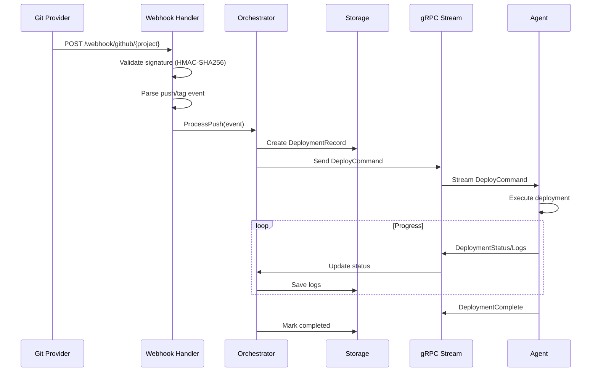

# VCDeploy Architecture

This document describes the architecture of VCDeploy, a deployment automation platform following a master-agent architecture.

## High-Level Architecture

```
┌─────────────────────────────────────────────────────────────────┐
│                        Master Server                             │
│  • HTTP API + Web UI (port 9000)                                │
│  • gRPC server for agents (port 9001)                           │
│  • SQLite database                                               │
│  • Webhook receiver                                              │
└─────────────────────────────────────────────────────────────────┘
        │                                    │
        │ gRPC (persistent, mTLS)            │ SSH (on-demand)
        ▼                                    ▼
┌─────────────────┐                ┌─────────────────┐
│    Agent        │                │   SSH Target    │
│  • Real-time    │                │  • Jump server  │
│    log stream   │                │    support      │
│  • Health       │                │  • No agent     │
│    metrics      │                │    required     │
└─────────────────┘                └─────────────────┘
```

### Components

| Component | Entry Point | Description |
|-----------|-------------|-------------|
| **Master** | `cmd/vcdeploy/main.go` | Central control plane: REST API, Web UI, gRPC server, webhook handler |
| **Agent** | `cmd/vcdeploy-agent/main.go` | Deployment executor: runs on target servers, maintains gRPC connection |
| **CLI** | `cmd/vcdeploy/main.go` | User interface for both local and remote operations |

## Package Structure

### Core Packages

| Package | Purpose |
|---------|---------|
| `internal/agent` | Agent daemon implementation |
| `internal/config` | Configuration structures (YAML parsing) |
| `internal/deploy` | Deployment execution logic (`Executor`, `Orchestrator`, `ArchiveRunner`) |
| `internal/server` | Master HTTP/gRPC servers, handlers, middleware |
| `internal/services` | Business logic layer with clean interfaces |
| `internal/storage` | SQLite database operations, models, migrations |

### Supporting Packages

| Package | Purpose |
|---------|---------|
| `internal/alerting` | System alerting (disk, CPU, memory warnings) |
| `internal/metrics` | Prometheus metrics |
| `internal/notify` | Multi-channel notifications (Slack, Email, Custom) |
| `internal/proto` | Generated gRPC code from `api/proto/*.proto` |
| `internal/provision` | Agent provisioning/lifecycle |
| `internal/scheduler` | Background job scheduling |
| `internal/security` | Encryption, auth, host keys, TOTP |
| `internal/tracing` | OpenTelemetry instrumentation |
| `internal/validation` | Input validation utilities |
| `internal/webhooks` | Git provider webhook parsing |

## Service Layer Architecture

Business logic follows a clean interface pattern with dependency injection:

```
HTTP Layer → Service Layer → Storage Layer
```

### Service Interfaces (from `internal/services/interfaces.go`)

| Service | Purpose |
|---------|---------|
| `UserServicer` | User CRUD, password verification, TOTP |
| `SessionServicer` | Login session management |
| `APIKeyServicer` | API key generation/validation |
| `ProjectServicer` | Project CRUD operations |
| `DeploymentServicer` | Deployment records, logs, scheduling |
| `AgentServicer` | Agent registration, status tracking |
| `SecretServicer` | Encrypted secret storage |
| `SettingsServicer` | Application settings |
| `AuditServicer` | Audit logging |
| `WebhookServicer` | Project webhook configuration |
| `HostKeyServicer` | SSH host key management |
| `RateLimitServicer` | Rate limiting, IP blocking |
| `ProvisionServicer` | Agent provisioning jobs |

## Data Flow

### Webhook-Triggered Deployment



### Deployment Process

1. **Prepare**: Create release directory (`/var/www/app/releases/YYYYMMDD-HHMMSS/`)
2. **Fetch**: Clone repository or pull updates
3. **Build**: Run build commands (if configured)
4. **Link Shared**: Symlink shared directories/files
5. **Hooks**: Run pre-deploy hooks
6. **Switch**: Atomically update `current` symlink
7. **Hooks**: Run post-deploy hooks
8. **Cleanup**: Remove old releases (keep N configured)
9. **Report**: Send completion status

### Directory Structure

```
/var/www/myapp/
├── current -> releases/20240115-120000/    # Atomic symlink
├── releases/
│   ├── 20240115-120000/                    # Latest
│   ├── 20240114-093000/                    # Previous (rollback target)
│   └── 20240113-150000/                    # Older
└── shared/
    ├── logs/                               # Persistent logs
    ├── uploads/                            # User uploads
    └── .env                                # Environment file
```

## Security Model

### Authentication Methods

| Method | Use Case | Implementation |
|--------|----------|----------------|
| **Session + Cookie** | Web UI login | `SessionServicer`, secure cookies |
| **API Keys** | CLI/programmatic access | `APIKeyServicer`, hashed storage |
| **Token** | Agent registration | Pre-shared token in config |
| **mTLS** | Agent communication | Client certificates |

### Authorization

- **RBAC**: Users have roles (`admin`, `user`)
- **Scopes**: API keys have limited scopes
- **2FA**: Optional TOTP for admin accounts

### Encryption

| What | Algorithm |
|------|-----------|
| **Secrets at rest** | AES-256-GCM |
| **Passwords** | bcrypt (default), Argon2id |
| **API keys** | SHA-256 hash (stored) |
| **Master key** | 32-byte random |

**KMS Key Format**: `v1:{key_id}:{base64_nonce}:{base64_ciphertext}`

### Security Middleware

- **HSTS**: HTTP Strict Transport Security
- **CSP**: Content Security Policy
- **CSRF**: Token-based protection
- **X-Frame-Options**: Clickjacking protection
- **Rate Limiting**: IP-based, configurable thresholds

## gRPC Protocol

Defined in `api/proto/agent.proto`:

```protobuf
service AgentService {
  rpc Register(RegisterRequest) returns (RegisterResponse);
  rpc Connect(stream AgentMessage) returns (stream MasterMessage);
  rpc Heartbeat(HeartbeatRequest) returns (HeartbeatResponse);
}
```

**Message Types**:
- **Agent → Master**: `LogEntry`, `DeploymentStatus`, `Metrics`, `UpdateResult`
- **Master → Agent**: `DeployCommand`, `RollbackCommand`, `CancelCommand`, `HealthCheckCommand`, `UpdateCommand`

## Configuration

| File | Purpose |
|------|---------|
| `configs/master.yaml` | Master server configuration |
| `configs/agent.yaml` | Agent configuration |
| `configs/projects/*.yaml` | Per-project deployment settings |
| `configs/types/*.yaml` | Project type templates |

### Default Ports

- **HTTP API**: 9000
- **gRPC**: 9001

Configuration defaults are centralized in `internal/config/defaults.go`.

## Observability

| Feature | Implementation |
|---------|----------------|
| **Metrics** | Prometheus (`/metrics` endpoint) |
| **Tracing** | OpenTelemetry (OTLP export) |
| **Logging** | Zap structured logging |
| **Health** | `/healthz`, `/livez`, `/readyz` endpoints |
| **Audit** | Database-backed audit trail |

## Design Patterns

| Pattern | Usage |
|---------|-------|
| **Layered Architecture** | HTTP → Service → Storage |
| **Interface Segregation** | `internal/services/interfaces.go` |
| **Strategy Pattern** | Deployment strategies (symlink vs in-place) |
| **Observer Pattern** | Notification manager |
| **Factory Pattern** | Server and service initialization |
| **Command Pattern** | `DeployCommand`, `RollbackCommand` |
